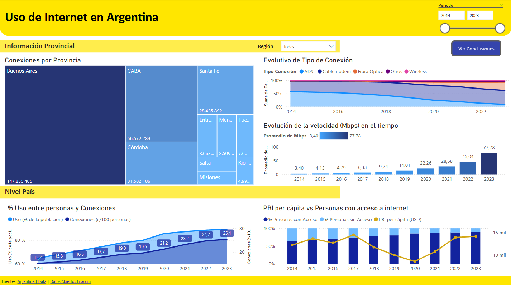

# ML-Challenge-Analytics

Proyecto donde se presenta un informe realizado en Power BI sobre el uso de internet en Argentina.
En el mismo se puede visualizar Distribucion de conexiones en el pais, tipos de tecnologias usadas para la conexion, porcentaje de usuarios en el tiempo, entre otras cosas.

Para acceder al informe y poder interactuar con el mismo, entre al siguiente enlace:

### [Uso del internet en Argentina](https://app.powerbi.com/view?r=eyJrIjoiN2VhN2EyNjktZTlhYy00MTE3LTk1MzctNzVhYmEyNTkyYmEyIiwidCI6ImEyMWY1ODE5LTViMmEtNGQ5Yi04ODg5LTE0OGRiYzg0YWMwOSIsImMiOjR9)

### Vista Previa

#### Fuentes
A continuacion, se listan las fuentes utilizadas para el informe:

- [World Bank | Argentina](https://data.worldbank.org/country/argentina) 
- [Datos Abiertos ENACOM](https://indicadores.enacom.gob.ar/datos-abiertos-servicios)

Para mejor disponibilidad de los datos utilizados, los archivos utilizados se pueden encontrar dentro de la carpeta `sources`.